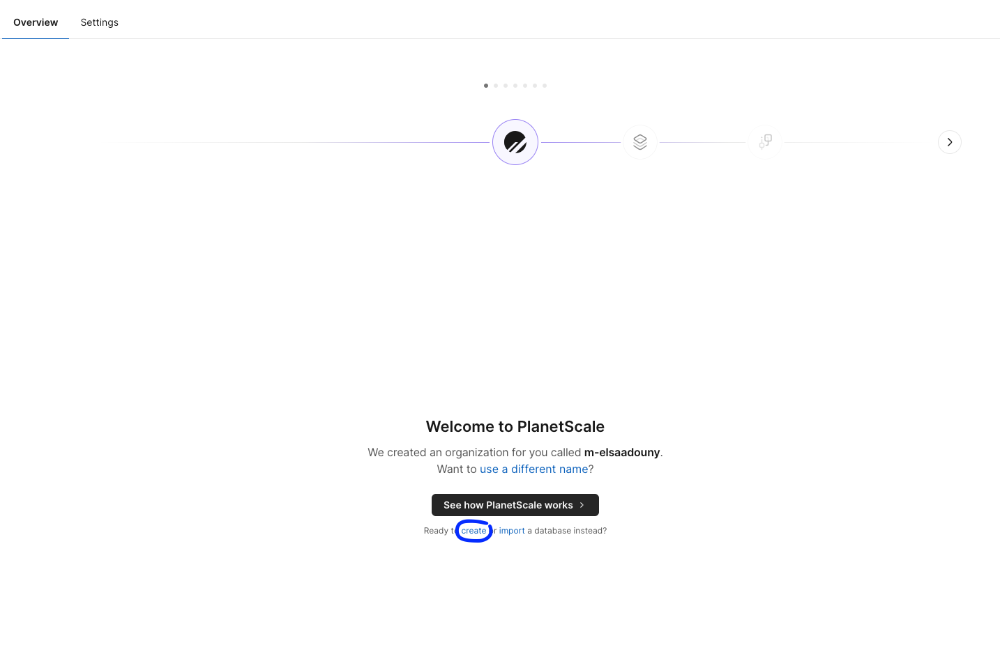
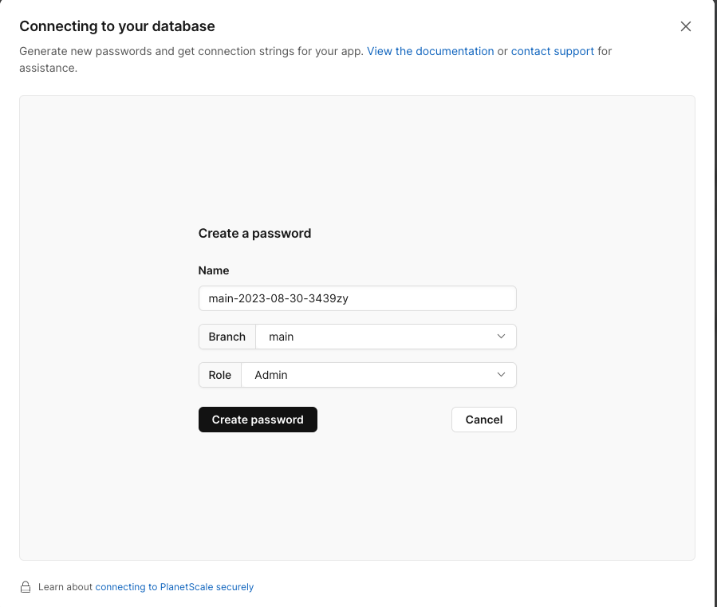

# [ProdGPT](https://huggingface.co/stabilityai/stable-diffusion-2-inpainting)

This repository is dedicated to the development of a Next.js SaaS AI Platform for **generating advertising images** using AI. The model utilizes [stable-diffusion-2-inpainting](https://huggingface.co/stabilityai/stable-diffusion-2-inpainting) and [ControlNet](https://github.com/lllyasviel/ControlNet) algorithms to repaint the product backgrounds based on an input image and a text description of the desired output image. It is advisable to use images with transparent or simple backgrounds.

<div style="display: flex; justify-content: center;">
    
    
</div>

## 📖 Prerequisites

### Clone the repository

```bash
git clone https://github.com/Elsaam2y/ProdGPT.git
```

### Install packages

```shell
cd ProdGPT
npm install
```

### Creating an API Key for Replicate to Run Model Predictions

1. Visit [Replicate](https://replicate.com/) and create an account.
2. Generate a token under `API Tokens` or use the default token.
3. Copy your API token and add it to your `.env` file.
4. If you plan to run more predictions, you might need to set a monthly limit under your `Billing` and provide your payment method.

### Creating an API Key for Clerk to Enable Authentication (Next.js)

1. Go to [Clerk](https://clerk.com/) and create an account.
2. Once you're logged into your account, create a new application by submitting the application name, selecting how users will sign in, and then clicking on `CREATE APPLICATION`.
3. After creating the application, copy `NEXT_PUBLIC_CLERK_PUBLISHABLE_KEY` and `CLERK_SECRET_KEY`, and add them to your `.env` file.

### Database Management

1. Navigate to [Planetscale](https://planetscale.com/) to create a SQL database.
2. After creating an account, select "Create a New Database."

<!-- <div style="display: flex; justify-content: center;">
    
</div> -->

3. Specify the Database name, select the Hobby (free tier) plan, and then click "Create." You might be asked to provide a payment method, but you won't be charged since you're selecting the free tier.
4. Once the database is initialized, select "Connect." Create a password and connect using `**prisma**`.

<!-- <div style="display: flex; justify-content: center;">
    
</div> -->

5. Copy the `DATABASE_URL` and place it in your `.env` file. Your `.env` file should follow this structure:

```js
NEXT_PUBLIC_APP_URL="http://localhost:3000"

REPLICATE_API_TOKEN=

# Authentication
NEXT_PUBLIC_CLERK_PUBLISHABLE_KEY=
CLERK_SECRET_KEY=
NEXT_PUBLIC_CLERK_SIGN_IN_URL=/sign-in
NEXT_PUBLIC_CLERK_SIGN_UP_URL=/sign-up
NEXT_PUBLIC_CLERK_AFTER_SIGN_IN_URL=/Images
NEXT_PUBLIC_CLERK_AFTER_SIGN_UP_URL=/Images

# Database
DATABASE_URL=
```

## ⌨️ Running the application

- Run the following command to start the application. You can access the application at `http://localhost:3000`.

```bash
npm run dev
```

- If you wish to test without limitations, you can adjust the [MAX_FREE_COUNTS](https://github.com/Elsaam2y/ProdGPT/blob/afc974a6e935bf8062bcac6eb4290e82cfcfdf68/constants.ts#L3) value to a higher number. This will increase the generation limit.

- For testing the Stripe payment system, there are a few intricacies. To better understand this step, refer to this [tutorial](https://youtu.be/ffJ38dBzrlY?t=14687) that helped me comprehend this specific aspect.

## 🚀 Deploy

You can deploy the application using [Vercel](https://vercel.com?utm_source=github&utm_medium=readme&utm_campaign=vercel-examples).

## 💫 Acknowledgments

I would like to express my sincere gratitude to the following repositories, which have been instrumental in shaping and influencing many parts of this application, especially the **Stripe** payment.

- [next13-ai-saas](https://github.com/AntonioErdeljac/next13-ai-saas)
- [RoomGPT](https://github.com/Nutlope/roomGPT/tree/main)
